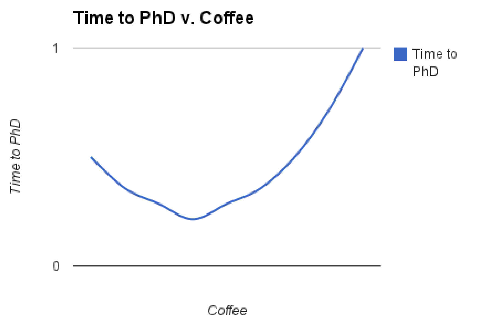
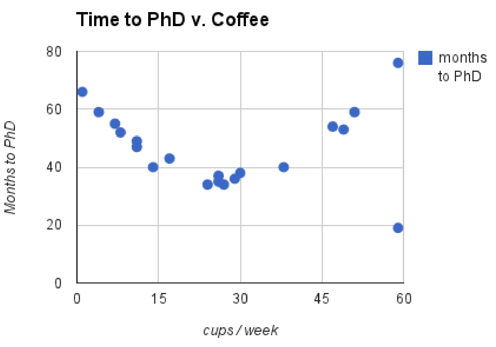

## The Coffee Experiment!

When I first started in graduate school my process for setting up and presenting experiments was more of a 'shoot from the hip' approach rather than one that followed a systematic protocol. Fortunately, I was taught a systematic protocol that is not only easy to follow but also has a direct translation to how an experiments section should be written in a paper. Without further ado here is an example of the protocol on a very important study (spoiler alert: yes, I just needed to be reminded to follow the scientific protocol I learned in 5th grade...). 

## Hypothesis

Caffeine makes graduate students more productive.

## Proxy

To measure the productivity of graduate students, we use the time it takes to complete their
PhD as the proxy. To measure the caffeine that each student takes, we use the
number of cups of coffee a students drinks as the proxy.

*Note that we do not count caffeine that comes from other sources such as tea or soda.*

## Protocol

Out of the 100 students in our school, have them report the mean cups of coffee they drink
each week. Also, record the date they start their PhD and the date they get their PhD. Only
consider students who have left the school with a PhD.

*Note that if a student is very productive, but dies of caffeine toxicity days before they finish
their PhD, they will not be counted.*

*Note that since we record mean cups of coffee per week, we do not capture information about
increases or decreases throughout their PhD.*

## Expected Results

We expect that students without caffeine take a long time to get their PhD; students who drink
a lot of caffeine finish their PhD very quickly. But drinking too much caffeine would cause
caffeine toxicity and would length the time to get a PhD due to psychosis. In short, we expect
a convex curve like the one below.

Since it is convex, this implies there is some optimal amount of coffee to drink to minimize the
time spent working on a PhD.

## Results

The results match our expected results. We observe that the knee of the curve is at
approximately 30 cups of coffee per week with a PhD in 36 months; this seems to be the
optimal amount of coffee to drink to be a productive graduate student.

Note that there seems to be an outlier who drinks about 60 cups of coffee a week but finished
their PhD in 19 months. We tracked down this student and found out that they drink 5 large
iced Americanos a day. Upon further testing, we discovered that this student is immune to
caffeine toxicity.

Raw data for results are stored here:

https://docs.google.com/spreadsheet/ccc?key=<put_data_here>

